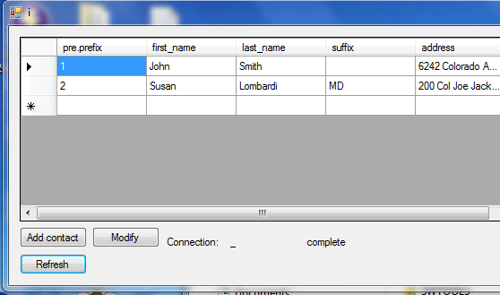

ContactsApp
===========
John Vishnefske

Example full stack .NET application. Console client (targeting .NET 8.0) consuming an ASP.NET Core gRPC API with a SQL backend. The API is designed to run on Linux.

## TODO

*   - [x] **Database Setup:** The `ContactsApi` now uses **SQLite**. The database file (`contacts.db`) will be automatically created and initialized with necessary tables (Contacts, Prefixes, Suffixes) and initial lookup data when the API starts for the first time. No manual setup is required.
*   - [x] **API Configuration:** The `ContactsApi`'s database connection string is now configured in `appsettings.json` under the `ConnectionStrings:DefaultConnection` key. The `Utilities` class is now a service that reads this configuration. Ensure the gRPC endpoint is correctly exposed (e.g., `https://localhost:7001`).
*   - [x] **Client Configuration:** The `Client` console application's gRPC endpoint address is now configurable via `Client/App.config` under the `GrpcApiAddress` key.
*   - [x] **Clean Build:** Achieve a build with zero errors and zero warnings across all projects.
*   - [x] **Error Handling & Logging:** Enhanced error handling and structured logging have been implemented:
    *   **API:** `ContactsGrpcService` and `LookupsGrpcService` now include `try-catch` blocks to handle exceptions from the `Utilities` layer, logging errors and returning appropriate `RpcException` statuses (e.g., `StatusCode.Internal`, `StatusCode.NotFound`). `Utilities` also logs its operations.
    *   **Client:** `Client/Program.cs` now includes `try-catch` blocks around gRPC calls to catch `RpcException` and display user-friendly error messages.
    *   **Logging Configuration:** `ContactsApi/Program.cs` is configured for console and debug logging.
*   - [ ] **User Interface:** The current client is a console application. If a graphical user interface (GUI) is desired, a new client project would need to be developed using a cross-platform UI framework (e.g., Avalonia UI, .NET MAUI). (Out of Scope for this request)
*   - [x] **Testing:**
    *   - [x] **Unit Testing:** Unit tests are implemented for `ContactsApi`'s persistence layer (`UtilitiesTests.cs`) and gRPC services (`ContactsGrpcServiceTests.cs`, `LookupsGrpcServiceTests.cs`). These tests mock dependencies and use `TestServerCallContext` for isolated testing of service logic. `IConfiguration` mocking has been made robust using `ConfigurationBuilder.AddInMemoryCollection()`.
    *   - [x] **Integration Testing:** A new `ContactsApi.Tests/IntegrationTests.cs` class has been added. It uses `Microsoft.AspNetCore.Mvc.Testing` to host the `ContactsApi` in an in-memory test server and `Grpc.Net.ClientFactory` to create gRPC clients, allowing for end-to-end testing of the API.
*   - [ ] **Deployment:** Add basic instructions for deploying the `ContactsApi` to a Linux environment (e.g., Docker, Kestrel behind Nginx) and the `Client` console application. (Documentation Task)
*   **Best Practices for Simplicity:**
    *   - [x] **Asynchronous Programming:** Ensure all I/O-bound and long-running operations are truly asynchronous to avoid blocking calls and simplify concurrent execution flow.
    *   - [x] **Minimize Exceptions for Control Flow:** Exceptions are used only for truly exceptional conditions (e.g., missing configuration, unexpected database errors), not for normal program flow (e.g., `GetContact` returns `null` or throws `RpcException.NotFound`).
    *   - [x] **Offload Long-Running Tasks:** This is not directly applicable to the current simple CRUD operations, as they are primarily I/O-bound and handled asynchronously.
    *   - [x] **Correct Context and Service Lifetime Management:** `HttpContext` is no longer relevant in the gRPC context. `Utilities` is registered as a singleton, ensuring a single instance manages database connections efficiently.
    *   - [ ] **Efficient Data Retrieval:** Retrieve only the necessary data from the database to simplify data models and reduce processing overhead. (General guideline, no specific code changes planned unless clear inefficiency is found).
